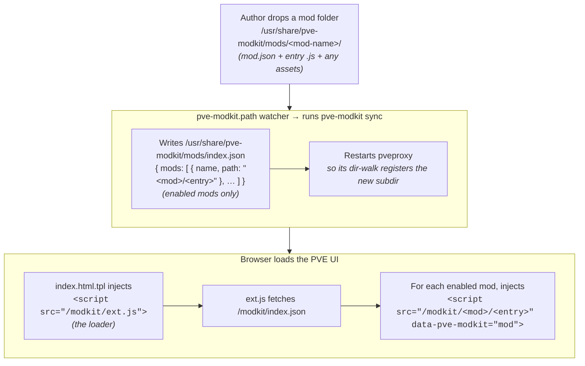

# pve-modkit

**A mod loader / plugin framework for the Proxmox VE web UI** (`pve-manager`, built on the Sencha ExtJS framework) — packaged as a proper
Debian `.deb`.

pve-modkit is **not a theme**. It's the *platform* that loads themes, badges, tweaks, and userscripts. You drop a self-contained mod folder
in; it's served, loaded, and injected — many mods side by side, no collisions, no build step. Install the `.deb`, drop a mod folder in,
refresh the Proxmox web UI in your browser — done. The bundled systemd `.path` watcher detects the new folder and does everything else
(regenerates the manifest and restarts `pveproxy` so the mod's routes register) with no further interaction.

The hard part isn't drawing a badge — it's touching `pve-manager`'s files **safely**. Proxmox ships no supported hook for extending the web
UI and [asks vendors not to modify the stock files](https://lists.proxmox.com/pipermail/pve-devel/) — yet every theme and userscript in the
wild tells you to hand-edit `index.html.tpl` anyway, with no backups and nothing to survive the next `apt upgrade`. pve-modkit does that
patching **for** you: idempotently, with byte-for-byte backups, validated by the real Template Toolkit and Perl parsers, re-applied
automatically on upgrade via dpkg triggers, and cleanly **reversible** on removal. That surgical, upgrade-safe, fully purgeable patching
engine — not any one mod — is the product. See [Prior art & how pve-modkit differs](#prior-art--how-pve-modkit-differs).

---

## Table of contents

- [What it does](#what-it-does)
- [Prior art & how pve-modkit differs](#prior-art--how-pve-modkit-differs)
- [Architecture](#architecture)
- [Installing the kit](#installing-the-kit)
- [Authoring a mod](#authoring-a-mod)
    - [The mod folder convention](#the-mod-folder-convention)
    - [`mod.json` schema](#modjson-schema)
    - [Lenient defaulting](#lenient-defaulting)
    - [Writing the entry script](#writing-the-entry-script)
    - [Step-by-step: add a mod](#step-by-step-add-a-mod)
- [The `pve-modkit` CLI](#the-pve-modkit-cli)
- [Reload vs. restart (important)](#reload-vs-restart-important)
- [Worked example: the default mod](#worked-example-the-default-mod)
- [How it survives upgrades](#how-it-survives-upgrades)
- [Uninstalling](#uninstalling)
- [Troubleshooting](#troubleshooting)

---

## What it does

The kit makes exactly **two idempotent, reversible edits** to the running system, each guarded by a backup + validation + restore-on-failure
envelope:

1. **Template patch** — injects a single loader `<script>` tag into
   `/usr/share/pve-manager/index.html.tpl` just before `</head>`:

   ```html
   <script src="/modkit/ext.js" data-pve-modkit="loader"></script>
   ```

2. **Static-route patch** — registers a new served directory key in
   `/usr/share/perl5/PVE/Service/pveproxy.pm` so that everything under
   `/usr/share/pve-modkit/mods/` is served by `pveproxy` at the URL prefix
   `/modkit/`:

   ```perl
   add_dirs($dirs, '/modkit/' => '/usr/share/pve-modkit/mods/'); # pve-modkit-served
   ```

Both patches are done structurally and safely:

- The template is [Template Toolkit](https://template-toolkit.org/docs/index.html)
  (`[% ... %]` directives), which is *not* valid HTML — so it is never parsed as a DOM. The tag is spliced textually and then the whole file
  is run through the Template Toolkit renderer to prove it still compiles. If it doesn't, the original is restored and the tool refuses to
  proceed.
- `pveproxy.pm` is a Perl source file — it is parsed with **PPI** to locate a stable anchor, the new line is spliced in, the result is
  re-parsed and run through `perl -c`. On any failure the original is restored.

Everything the kit *owns* lives under `/usr/share/pve-modkit/`. The two files it touches in `pve-manager`/`pve-http-server` territory are
backed up (0600) under `/usr/share/pve-modkit/originals/` and restored byte-for-byte on removal.

---

## Prior art & how pve-modkit differs

People have been modding the PVE web UI for years. The existing work clusters into two shapes, and pve-modkit occupies the gap between them.

**Single-purpose UI themes.** Projects like [PVEDiscordDark](https://github.com/Weilbyte/PVEDiscordDark) (the ~3k-star anchor of this
space), [proxmorph](https://github.com/IT-BAER/proxmorph), and a long tail of Nord/Catppuccin/Solar palettes each ship *one* fixed look.
Most are installed by a shell script that appends a `<script>`/`<link>` to `index.html.tpl` by hand; several don't survive a `pve-manager`
upgrade, and none give you a way to run *several* independent tweaks at once. proxmorph is the closest mechanism cousin — it re-patches via
an APT hook so it *does* survive upgrades — but it's still theming-only and shell-driven, not a package.

**Single-purpose patchers** (mostly subscription-nag removers) like [pve-nag-buster](https://github.com/foundObjects/pve-nag-buster) and
[free-pmx no-nag](https://free-pmx.pages.dev/) pioneered the *persistence* mechanism this project relies on: an idempotent search-and-replace
patcher that backs up, re-applies on upgrade via a dpkg/APT hook, and can be reverted. Their engineering rigor rivals pve-modkit's — but each
one does exactly one thing to one file.

**What's missing — and what pve-modkit is.** Nobody combines all four of: a real Debian `.deb`; upgrade-surviving dpkg-trigger re-patching;
a *general, pluggable, multi-mod* loader for the UI (not a single hard-coded theme); and idempotent, validated, backup/restore patching. The
demand is real and recent — the Proxmox forums carry threads asking literally *"is there a mod repository / how do I make mods?"* and
requesting userscript support in the web UI — while Proxmox itself has [declined to build a plugin system upstream](https://lists.proxmox.com/pipermail/pve-devel/)
and asks vendors not to touch the stock files. pve-modkit is the answer to that gap: the safe, reversible, upgrade-safe patching engine that
lets *any* of the above — a theme, a nag-remover, a badge, your own userscript — ship as a drop-in mod folder instead of a fragile hand-hack.
The themes and tweaks above aren't competitors; they're **content** that could live inside pve-modkit as mods.

---

## Architecture



**Why per-mod subdirectories work.** `pveproxy`'s static handler only serves a file if the *directory prefix* of the URL is an exact key in
its internal
`$dirs` table, and the filename component may not contain a slash. On its own, that would forbid `/modkit/<mod>/<file>`. However, `pveproxy`
's `add_dirs`
(in `PVE::APIServer::AnyEvent`) performs a `File::Find` walk of the target directory at startup and registers **every subdirectory it
finds** as its own served key (`/modkit/<mod>/`). So each mod's folder is served natively — no extra patching of `AnyEvent.pm` is required —
**as long as the subdirectory exists when `pveproxy` (re)starts**. See
[Reload vs. restart](#reload-vs-restart-important).

---

## Installing the kit

> [!IMPORTANT]
> Never install packages from sources/repositories you don't/can't verify independantly.

### Via `apt`

Add [`the-wondersmith/apt`](https://github.com/the-wondersmith/apt) to your local repositories:

```sh
curl -fsSL 'https://the-wondersmith.github.io/apt/bootstrap.tgz' \
| sudo tar -C / -xzf - && sudo apt update && sudo apt install -y \
pve-modkit wondersmith-apt-keyring
```

`pve-modkit` (and all packages in `the-wondersmith/apt`) are [built](.github/workflows/ci.yaml#L107) with SLSA build-provenance attestation
attached and [enforced](https://github.com/the-wondersmith/apt/blob/main/.github/workflows/publish.yaml#L334) by the repository's publishing
machinery.

### From Releases

Download the most recent `.deb` from [releases](https://github.com/the-wondersmith/pve-modkit/releases), then install it manually:

```sh
apt install path/to/pve-modkit.deb
```

### Post-Install Notes

On install the package:

- applies both patches (template + `pveproxy.pm`),
- generates the initial `/usr/share/pve-modkit/mods/index.json`,
- reloads `pveproxy`, and — because registering the new `/modkit/` route requires it — performs a **full `pveproxy` restart** the first time
  the route is added.

The package ships one deliberately subtle default mod, `modkit-active-badge`. Open the PVE web UI (`https://<host>:8006`) and you should see
a small
`modkit: active` badge sitting just to the right of the **Virtual Environment {version}** text in the header, tinted to match the current
theme. That's it — no other UI changes by default.

Fuller, more visual demos (a glowing Proxmox logo, a floating corner badge)
live in the source tree under [`examples/`](examples/) and are **not**
installed. See [Worked example: the default mod](#worked-example-the-default-mod).

---

## Authoring a mod

### The mod folder convention

A mod is a **named, self-contained folder** under the mods directory:

```
/usr/share/pve-modkit/mods/
├── index.json                 ← generated manifest (do not hand-edit)
├── ext.js                     ← the loader (shipped by the kit)
├── my-cool-mod/               ← YOUR mod
│   ├── mod.json               ← required metadata
│   ├── index.js               ← default entry point
│   └── logo.svg               ← any assets you like (served at /modkit/my-cool-mod/logo.svg)
└── another-mod/
    ├── mod.json
    └── main.js
```

Naming the folder after the mod is what lets a user install **many** mods side by side without collisions. Everything inside `my-cool-mod/`
is served at
`/modkit/my-cool-mod/...`, so relative asset references are simple and scoped.

### `mod.json` schema

Each mod folder contains a `mod.json`:

```json
{
  "name": "my-cool-mod",
  "version": "1.0.0",
  "description": "Adds a delightful thing to the PVE UI.",
  "entry": "index.js",
  "enabled": true
}
```

| Field         | Type    | Required | Default     | Meaning                                                    |
|---------------|---------|----------|-------------|------------------------------------------------------------|
| `name`        | string  | no       | folder name | Display name; falls back to the directory name.            |
| `version`     | string  | no       | —           | Informational only.                                        |
| `description` | string  | no       | —           | Informational only.                                        |
| `entry`       | string  | no       | `index.js`  | The script the loader injects, relative to the mod folder. |
| `enabled`     | boolean | no       | `true`      | Whether the mod is listed in the manifest and loaded.      |

### Lenient defaulting

The kit is deliberately forgiving so a single malformed mod never breaks the whole UI:

- **Missing or malformed `mod.json`** → the mod is still treated as **enabled** with entry `index.js`. A warning is printed, and *only that
  mod*
  is affected — every other mod still indexes normally (per-file isolation).
- **`enabled`** is honored **only if it is a real JSON boolean** (`true` /
  `false`). If it is omitted, `null`, or mistyped (e.g. the *string*
  `"false"`), the mod is treated as **enabled**. To actually disable a mod its
  `mod.json` must contain a genuine `false`.
- **`entry`** is honored **only if it is a non-empty string**; otherwise it falls back to `index.js`.
- If a mod is enabled but its resolved entry file does not exist on disk, it is **skipped** in the manifest (the kit won't publish a URL
  that would 404).

### Writing the entry script

The entry script is a plain browser script injected after the PVE UI's own JavaScript. A robust mod:

- wraps itself in an **IIFE** and guards against double-injection,
- waits for the UI to be ready (`Ext.onReady` when available, else
  `DOMContentLoaded`),
- is **idempotent** (safe to run twice), and
- is **purely additive** — prefer injecting your own DOM/CSS over mutating ExtJS components you don't own.

Minimal skeleton:

```js
(function () {
    "use strict";
    if (window.__myCoolModLoaded) {
        return;
    }
    window.__myCoolModLoaded = true;

    function run() {
        // ... inject your CSS / DOM here, idempotently ...
    }

    if (window.Ext && Ext.onReady) {
        Ext.onReady(run);
    } else {
        document.addEventListener("DOMContentLoaded", run);
    }
})();
```

### Step-by-step: add a mod

```sh
# 1. Create the mod folder
mkdir -p /usr/share/pve-modkit/mods/my-cool-mod

# 2. Write mod.json and the entry script
cat > /usr/share/pve-modkit/mods/my-cool-mod/mod.json <<'JSON'
{ "name": "my-cool-mod", "version": "1.0.0",
  "description": "Adds a delightful thing.", "entry": "index.js",
  "enabled": true }
JSON

$EDITOR /usr/share/pve-modkit/mods/my-cool-mod/index.js

# 3. Refresh the Proxmox web UI in your browser — done.
#    The `.path` watcher already ran `pve-modkit sync`, which regenerated the
#    manifest and restarted pveproxy for you. (Optionally confirm with:)
pve-modkit list
```

> **That's it — no manual command is required.** The systemd `.path` watcher
> (`pve-modkit.path`) fires when the top-level mods directory changes — which is
> exactly what happens when you *drop a mod folder in* (copy or move the folder
> in as a unit). It runs `pve-modkit sync`, which regenerates the manifest
> **and** restarts `pveproxy` automatically because the set of served
> `/modkit/{mod}/` routes changed. A plain file edit *inside* an existing mod
> folder does not change the route set, so it triggers no restart (and needs
> none) — just refresh the browser. If you ever want to force it by hand,
> `pve-modkit index` + `systemctl restart pveproxy` remains a reliable fallback.

---

## The `pve-modkit` CLI

`pve-modkit` is a single Perl program. All state-changing operations back up the target, validate the result, and restore on failure.

| Command                                                 | What it does                                                                                                                             | Exit codes                                                      |
|---------------------------------------------------------|------------------------------------------------------------------------------------------------------------------------------------------|-----------------------------------------------------------------|
| `pve-modkit patch tpl [--file F] [--remove]`            | Insert/remove the loader `<script>` in `index.html.tpl`. Validated by rendering through Template Toolkit.                                | `0` always                                                      |
| `pve-modkit patch pveproxy [--file F] [--remove]`       | Insert/remove the `/modkit/` route in `pveproxy.pm`. Validated with PPI + `perl -c`.                                                     | `0` no-op · `10` changed (restart needed) · non-zero on failure |
| `pve-modkit index [--dir D]`                            | Regenerate `mods/index.json` from enabled mods.                                                                                          | `0`                                                             |
| `pve-modkit sync [--dir D]`                             | Regenerate the manifest, then restart `pveproxy` **iff** a mod folder was added/removed since the last sync. Run by the `.path` watcher. | `0`                                                             |
| `pve-modkit enable <mod>... [--dir D]`                  | Set `enabled: true` in each mod's `mod.json`, regenerate the manifest.                                                                   | `0`                                                             |
| `pve-modkit disable <mod>... [--dir D]`                 | Set `enabled: false`, regenerate the manifest.                                                                                           | `0`                                                             |
| `pve-modkit list` (alias `status`) `[--dir D]`          | Print a table of installed mods: `NAME  STATE  SERVED  ENTRY`.                                                                           | `0`                                                             |
| `pve-modkit unpatch [--file-tpl F] [--file-pveproxy F]` | Remove both patches (used on uninstall).                                                                                                 | `0` no-op · `10` changed                                        |
| `pve-modkit help`                                       | Usage.                                                                                                                                   | `0`                                                             |

**Exit code `10`** is a deliberate signal: it means the `pveproxy.pm` route was actually added or removed, so the caller (the package's
maintainer scripts)
knows a **full `pveproxy` restart** is required rather than a reload.

`--dir` overrides the mods directory (defaults to
`/usr/share/pve-modkit/mods`) and is handy for testing against a scratch tree.

`pve-modkit list` example:

```
NAME                 STATE     SERVED  ENTRY
modkit-active-badge  enabled   yes     index.js
```

- `STATE` — `enabled`/`disabled` per `mod.json`.
- `SERVED` — `yes` only if the mod is enabled, its entry file exists, **and**
  it is present in the current `index.json`.
- `ENTRY` — the resolved entry file; annotated `(MISSING)` if the file is absent, `[bad mod.json]` if the metadata couldn't be parsed.

---

## Reload vs. restart (important)

`pveproxy` builds its table of served directories **once, at startup**, by walking `/usr/share/pve-modkit/mods/`. A
`systemctl reload pveproxy` only re-forks worker processes from the existing master image — it does **not**
re-run that walk. Therefore:

- **Template edits** and **manifest regeneration** (`pve-modkit index`,
  `enable`, `disable`) take effect with a plain reload (or immediately, for the manifest, since it's just a file the browser fetches).
- **Adding the `/modkit/` route itself, or adding a brand-new mod subdirectory,** requires a full **`systemctl restart pveproxy`** so the
  directory walk runs again and registers the new served key (s).

The package handles the route-registration restart for you on install (via the exit-`10` signal). **Adding or removing a mod folder
afterwards is also handled for you:** the `pve-modkit.path` watcher fires on the mods-directory change and runs `pve-modkit sync`, which
restarts `pveproxy` only when the set of mod folders actually changed. `sync` records the last-seen folder set under
`/run/pve-modkit/moddirs` (tmpfs, outside the watched dir so it can't loop) to tell an add/remove apart from an in-folder file edit. That
state lives on tmpfs and is wiped on reboot, so the first `sync` after a boot has no baseline to compare against; in that case `sync`
restarts `pveproxy` whenever any mods are present, guaranteeing every mod's routes are registered even across reboots without any action
from you. You can still restart `pveproxy` by hand if you prefer.

---

## Working example: the default mod

The package ships exactly one mod under `/usr/share/pve-modkit/mods/`:
`modkit-active-badge`. It's intentionally subtle - intended exclusively as a signal that the toolkit is loaded.
### `modkit-active-badge`

Adds a small "modkit: active" badge immediately to the right of the **Virtual Environment {version}** text in the PVE header, tinted to
match the active theme (it inherits `currentColor`, so it reads correctly in both light and dark).

- `mod.json`: `entry: index.js`, `enabled: true`.
- `index.js`: injects a `<style>` (theme-native pill with a small status dot and a gentle fade-in), locates the header version element via a
  defensive cascade (`#versioninfo` → `div[id="versioninfo"]` → a text-match fallback for an element whose text starts with
  `Virtual Environment`), and inserts the badge as a **next sibling** of that element — never a child, because PVE rewrites the version text
  in place via `el.update()` and would wipe a child. It is idempotent by id, retries for a few seconds while the ExtJS viewport mounts, and
  honors `prefers-reduced-motion`.

Try toggling it:

```sh
pve-modkit disable modkit-active-badge
pve-modkit list          # SERVED becomes "no"; badge disappears on reload
pve-modkit enable modkit-active-badge
```

### More examples (not installed)

Two richer demos live in the source tree under [`examples/`](examples) and are **not** shipped by the package — each has its own README:

- [`examples/demo-logo-glow`](examples/demo-logo-glow) — a soft, breathing glow on the Proxmox logo.
- [`examples/demo-corner-badge`](examples/demo-corner-badge) — a floating corner pill; a clean example of a purely additive mod that injects
  its own DOM node rather than touching an ExtJS component.

To try one, copy its folder into `/usr/share/pve-modkit/mods/`; the `.path`
watcher syncs it and restarts `pveproxy` automatically, so just refresh the web UI. See each example's README for details.

---

## How it survives upgrades

`pve-manager` re-installs `index.html.tpl` on upgrade (reverting the loader tag), and `pve-http-server` may rewrite `pveproxy.pm`. The
package registers two dpkg triggers so the patches are re-applied automatically whenever those files change:

```
interest-noawait /usr/share/pve-manager      # covers index.html.tpl
interest-noawait /usr/share/perl5/PVE        # covers pveproxy.pm
```

Both patches are idempotent, so re-triggering is safe and a no-op when already applied.

---

## Uninstalling

```sh
# Remove: unpatch both files (restored byte-for-byte from backups), drop the manifest
apt remove pve-modkit

# Purge: also remove /usr/share/pve-modkit entirely and the systemd units
apt purge pve-modkit
```

On removal the loader tag and the `/modkit/` route are cleanly removed and the original `index.html.tpl` and `pveproxy.pm` are restored from
the 0600 backups in `/usr/share/pve-modkit/originals/`.

---

## Troubleshooting

- **A mod's script 404s at `/modkit/<mod>/<entry>`** — the mod folder was added after `pveproxy` last started and the `.path` watcher hasn't
  synced it yet (e.g. the folder's files were copied in piecemeal rather than dropped in as a unit). Re-touch the folder or, as a fallback,
  run `systemctl restart pveproxy`.
- **`pve-modkit list` shows `SERVED: no`** — the mod is disabled, its entry file is missing, or the manifest is stale. Check `STATE`/
  `ENTRY`, fix, then
  `pve-modkit index`.
- **`ENTRY` shows `[bad mod.json]`** — the JSON couldn't be parsed; the mod still loads with lenient defaults (`index.js`, enabled), but fix
  the JSON to control `entry`/`enabled`.
- **Nothing appears at all** — confirm the loader tag is present (`grep pve-modkit /usr/share/pve-manager/index.html.tpl`) and that
  `/modkit/ext.js` returns 200; then check the browser console for the loader's
  `console.error` breadcrumbs.

## License

pve-modkit is licensed under the **GNU Affero General Public License, version 3
or later** (`AGPL-3.0-or-later`). See [`LICENSE`](LICENSE) for the full text.

Mods loaded by pve-modkit are separate, independently authored works that the
loader injects at runtime. They are aggregated with — not derived from — the
loader, so the AGPL on pve-modkit does **not** reach into your mods: mod authors
are free to license their own mods however they wish.
